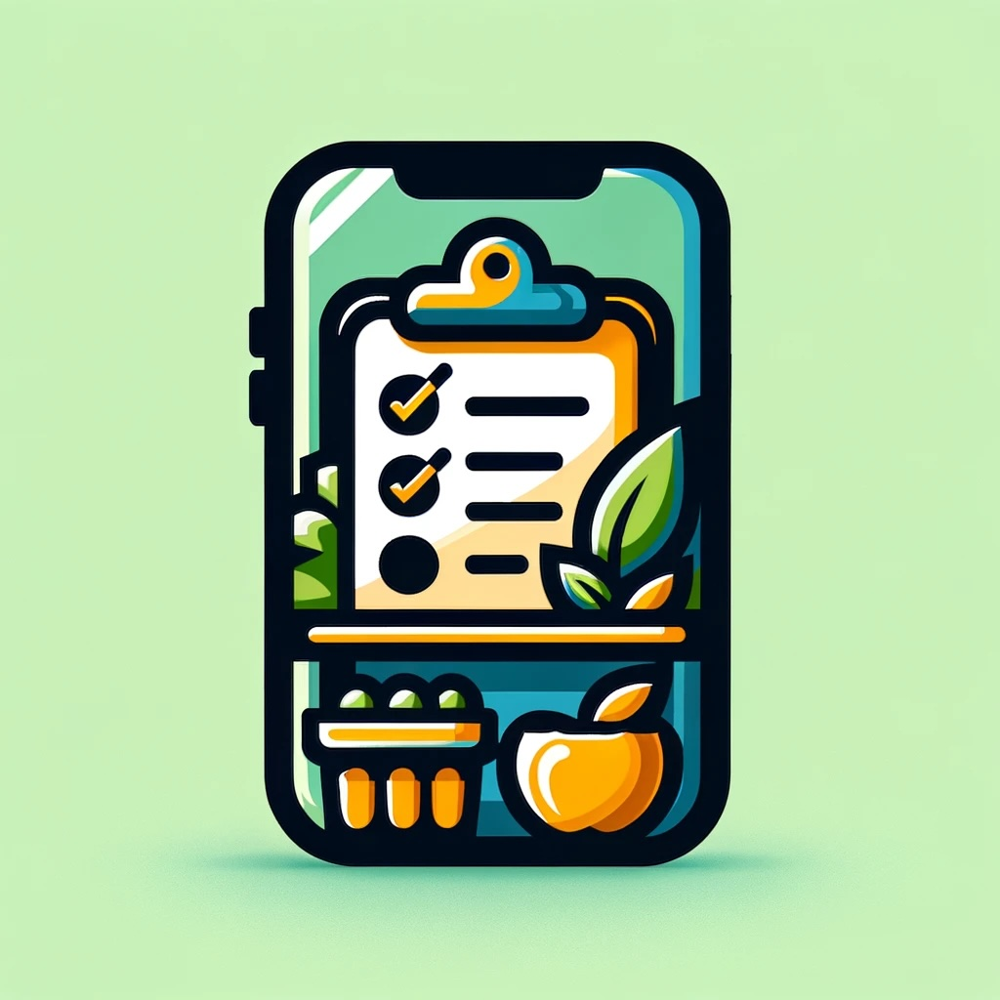

  

<h1 align="center">PantryPal</h1>

PantryPal is a single-screen grocery list app built using the Flutter SDK, focusing on functionality with a clean and intuitive user interface. The app leverages the BLoC pattern for state management, ensuring a well-organized architecture that separates business logic from the UI layer.

## App Architecture

### User Interface (UI)

- **Main Screen**: 
  - The top section houses text fields where users input the name and quantity of their desired grocery items. 
  - A submission is as simple as tapping the `Add Item` button, which dispatches an event to the `GroceryBloc`, 
  subsequently adding the item to the state-managed list. 
  - The heart of the interface is the dynamically populated list view, showcasing the current grocery items. 
  - Each entry in this list is interactive, equipped with edit and delete options, empowering users with full control over their grocery list. 
  - Editing an item is facilitated through a dialog, ensuring that modifications are both effortless and immediate.
### State Management (BLoC/Cubit)
- **GroceryBloc**: Manages the application's state, specifically the grocery list, by reacting to user interactions and 
  - updating the list accordingly. It handles the following:
- **Events**:
  - `LoadGroceryList`: Triggered to load the grocery list from local storage (using `SharedPreferences`).
  - `AddGroceryItem`: Dispatched when a new item is added to the grocery list. It contains the GroceryItem to be added.
  - `RemoveGroceryItem`: Triggered when an item is to be removed from the list, identified by its index. 
  - `UpdateGroceryItem`: Dispatched to update an existing item in the list, identified by its index and the new GroceryItem data.
- **States**:
    Represents the state of the grocery list with a property `groceryItems`, a list of `GroceryItem` objects.
#### BLoC Implementation Details
- `_onLoadGroceryList`: 
  - Retrieves the grocery list stored in `SharedPreferences`.
  - Decodes the JSON stored list and emits a `GroceryState` with the updated grocery items.
- `_onAddGroceryItem`:
  - Adds a new item to the grocery list state and updates the list stored in `SharedPreferences`.
- `_onRemoveGroceryItem`:
  - Removes the item at the specified index from the grocery list state and updates the list stored in `SharedPreferences`.
- `_onUpdateGroceryItem`:
  - Updates the item at the specified index with the new data and refreshes the stored list in `SharedPreferences`.
- `_saveListToPrefs`:
  - A utility function to encode the current list of grocery items as JSON and save it to `SharedPreferences`.
  - **Ensures that the list persists across app restarts.**
### Model

- **GroceryItem**: The data model for each item in the grocery list, including properties `name`, and `quantity`.

### Data Persistence

- **SharedPreferences**: Utilized for persisting the grocery list locally, ensuring data retention across app restarts.

### Business Logic Components (BLoC Pattern)

- The BLoC pattern is employed to maintain a clean separation between the business logic and the UI, facilitating maintainability and testability.

## Developer Instructions

### Setting Up the Development Environment

1. **Install Flutter**: Follow the [Flutter installation guide](https://docs.flutter.dev/get-started/install) to set up your local development environment.
2. **Clone the Repository**: Clone this repository to your local machine using `git clone https://github.com/pythagoras-19/PantryPal.git`.
3. **Install Dependencies**: Navigate to the project directory and run `flutter pub get` to fetch all the required dependencies.

### Running the App

- **Start the Emulator**: Launch your Android or iOS emulator.
- **Run the App**: Execute `flutter run` within the project directory to start the app on your emulator or connected device.

### Making Contributions

1. **Fork the Repository**: Create a personal fork of the project on GitHub.
2. **Create a New Branch**: For each new feature or fix, create a new branch based on the latest main branch.
3. **Implement Your Changes**: Make your changes in the project, adhering to existing coding styles and patterns.
4. **Write Tests**: Add relevant tests to cover your changes and ensure existing tests pass using `flutter test`.
5. **Submit a Pull Request**: Push your changes to your fork and open a pull request to the main repository.

### Code Style and Conventions

- Ensure you follow the [Dart style guide](https://dart.dev/guides/language/effective-dart/style) for writing clean, readable, and idiomatic Dart code.
- Document your code where necessary, especially for public APIs and complex logic.

Remember to regularly pull the latest changes from the upstream main branch, keep your application updated with the latest dependencies, and ensure your contributions are well-tested and documented.
